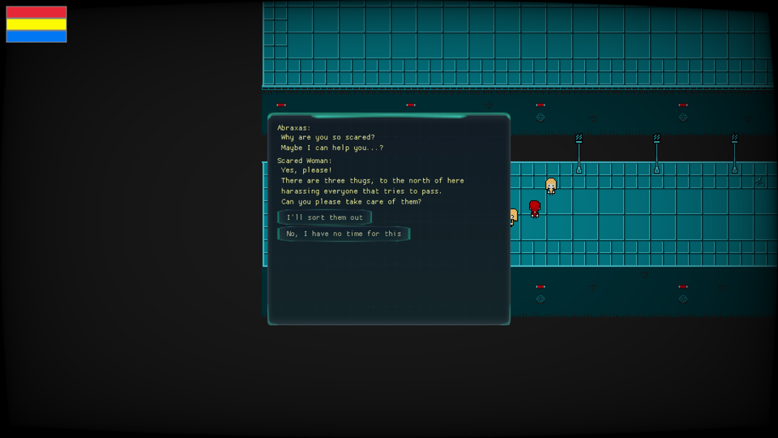
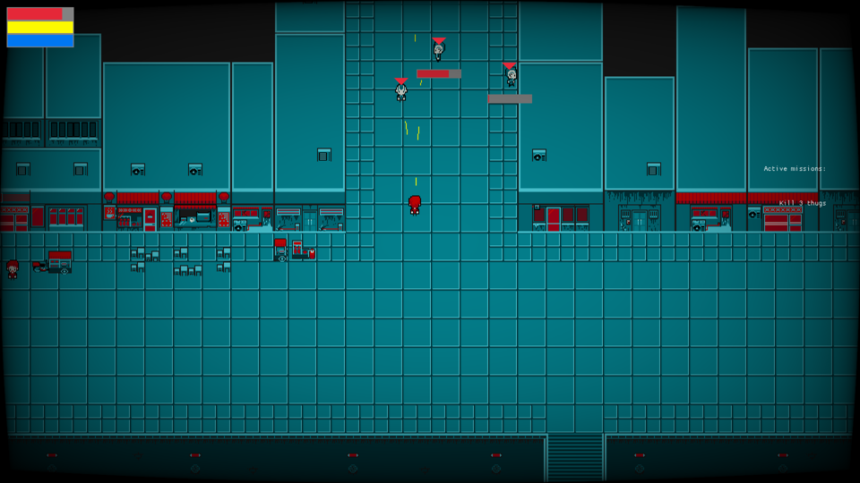
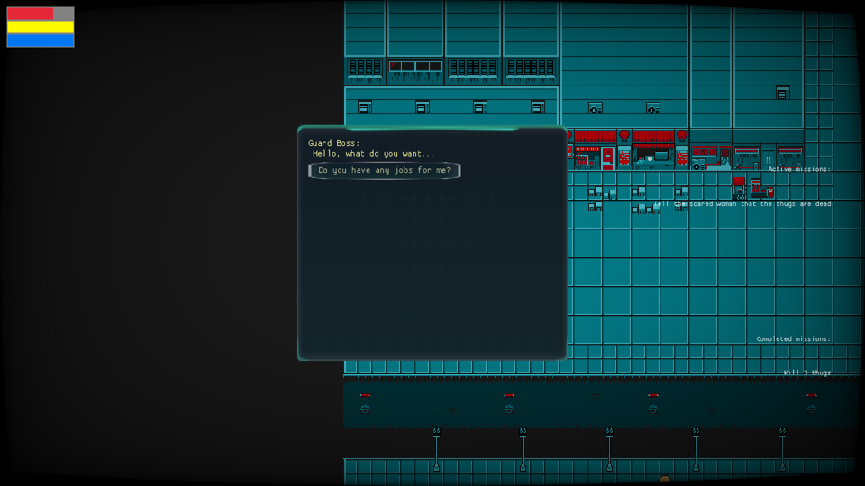

# Capstone

This is an action/run 'n' gun RPG, created in Rust using [macroquad](https://github.com/not-fl3/macroquad).
The future holds huge boss fights, and a mind-nuking story line, as you progress through the world, and your own mind, to battle yourself and the archons to break free of samsara and the materialist dystopia of our not too distant future.

## Screenshots

## License

The game is unlicensed because it has a planned commercial release, so  the game in its entirety, the IP (as it is fleshed out in the future), is ours and not to be copied.
Feel free to browse the code, however, and use anything you find for your own project(s). This means that you can copy and reuse implementation methods and bits of code, for commercial and non-commercial purposes, but you can't compile the game, with or without modifications, to distribute it.
You can, of course, compile the game and try it out, as long as it falls in under fair-use.

## Controls

- `W, A, S, D` or `arrows` for movement
- `Shift` for sprint
- `Left Mouse Button` for primary ability (needs an equipped weapon)
- `Right Mouse Button` for secondary ability (needs an equipped trinket, for now)
- `F` to interact and pay respect
- `R` to pick up nearby items
- `I` for inventory window
- `C` for character window
- `P` to toggle debug mode
- `ESC` to open menu

To use the primary and secondary abilities, go to Inventory and equip a weapon and a trinket....

## Features

This is a work in progress but current features include (not an exhaustive list as we are adding features at a high pace):

- Composable actors, from code or by JSON [assets/actors.json](https://github.com/olefasting/capstone/blob/master/assets/actors.json)
- Very basic AI behavior, with aggression levels that can be set on actor prototypes, through JSON or through code, that determine how they react to other actors of other factions. There are also visibility and noise levels, as factors determining how AI actors will react to their surroundings.
- RPG mechanics, such as character stats and various abilities
- Composable items, from code or by JSON [assets/items.json](https://github.com/olefasting/capstone/blob/master/assets/items.json), character inventory and more
- Dynamic resource loading, so textures can be added by editing [assets/resources.json](https://github.com/olefasting/capstone/blob/master/assets/resources.json) and referenced by `texture_id` in actors and items, both in-code and in the corresponding json-files
- Create maps either by writing them in JSON, manually, or by importing and converting Tiled maps
- Scriptable dialogue system (see [assets/dialogue.json](https://github.com/olefasting/capstone/blob/master/assets/dialogue.json))
- Scriptable mission and reward system (see [assets/dialogue.json](https://github.com/olefasting/capstone/blob/master/assets/missions.json))

## In the works

- Skills and abilities gained through level progression
- Saving and loading
- Gamepad support
- Dynamic lighting and post-processing
- Online and local coop

## Credits

All assets currently used are placeholders, taken from ich.io. When writing this, credits for assets are due to:

- [Wenrexa Minimal UI Kit](https://wenrexa.itch.io/kit-nesia2) (UI theme)
- [Free UI Kit #4](https://wenrexa.itch.io/ui-different02) (UI theme)
- [Neo Zero Cyberpunk City Tileset](https://yunusyanin.itch.io/neo-zero-cyberpunk-city-tileset) (map tiles and props)
- [Cyberpunk Top Down Game Asset Pack](https://rafazcruz.itch.io/cyberpunk-top-down-game-asset-pack) (currently not used but included in the repository)
- [Cyberpunk Items 16x16](https://jeresikstus.itch.io/cyberpunk-items-16x16) (currently used for all item graphics)
- [Animated Fires](https://stealthix.itch.io/animated-fires) (some animated fire effects)
- [M4A1 Single sound by Kibblesbob](https://soundbible.com/1804-M4A1-Single.html) ([Creative Commons Attribution 3.0](https://creativecommons.org/licenses/by/3.0/))
- [9mm Glock 17 sound by JKirsch](https://soundbible.com/1382-9mm-Glock-17.html) ([Creative Commons Attribution 3.0](https://creativecommons.org/licenses/by/3.0/))

Copyright 2021 Ole A. Sjo Fasting and [Magus](https://magus.no)

UNLICENSED
